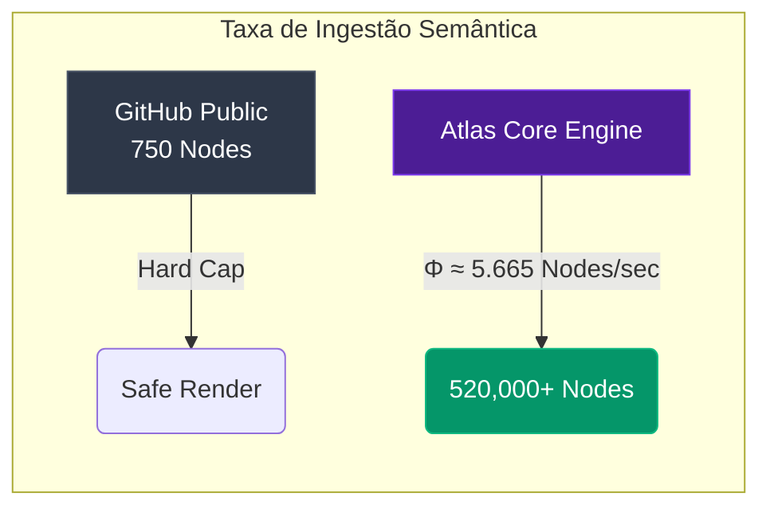

# Atlas Cortex 🌐

**O Motor de Integridade Semântica para IA Generativa (GenAI)**

O **Atlas Cortex** é um motor de pré-processamento para sistemas corporativos GraphRAG. Ele foi construído para resolver o maior gargalo atual na ingestão de dados para LLMs: o **Colapso de Contexto** e a **Diluição de Sinal**. 

Ao invés de fatiar documentos de forma mecânica e cega por contagem de tokens (como o `RecursiveCharacterTextSplitter` do LangChain, que corta frases e blocos de código pela metade), o Atlas utiliza o **Roteamento Semântico Atômico**. Ele escaneia a topologia do documento (Markdown, HTML, AST de Códigos) e extrai os dados ancorados em nós estruturais, preservando 100% da integridade da informação e evitando alucinações (fenômeno análogo ao *Barren Plateaus* em Quantum Machine Learning).

---

## 📚 Documentação e Provas Técnicas

O arcabouço teórico e as provas de conceito empíricas encontram-se disponíveis na pasta `docs/`:

- 🇧🇷 [Artigo Científico Principal (Português)](docs/Paper_Atlas_Cortex_PT.md) - *Recomendado*
- 🇺🇸 [Main Whitepaper (English)](docs/Paper_Atlas_Cortex_EN.md)
- 📊 [Benchmark Empírico (Needle-In-A-Haystack e Dogfooding)](docs/QML_Ingestion_Proof.md)

---

## ⚡ Motor de Ingestão (Binário Fechado)

Para proteger a propriedade intelectual e o segredo industrial do Roteador em Cascata, o algoritmo original não está exposto. Disponibilizamos o motor compilado (`.exe`) via protocolo Aegis.

- **Local:** `bin/atlas-cortex-cli.exe`
- O binário é um executável portátil construído para ambientes Windows, capaz de varrer diretórios e arquivos zip caóticos puramente em memória (I/O livre de gargalos) e gerar o **MOC** (Map of Content) em formato de Grafo JSON a impressionantes **0.003s**.

### ⚖️ Licenciamento & Cota Gratuita (Freemium)

O Atlas-Cortex opera sob um modelo de adoção livre para desenvolvedores e laboratórios de IA. 

O binário distribuído neste repositório permite o processamento gratuito de até **750 Nós Semânticos**. Essa cota é calculada para provas de conceito, automação pessoal e testes laboratoriais (equivalente a repositórios de código médios ou alguns livros curtos). O sistema contabiliza os nós gerados e trava a execução localmente utilizando ancoragem física de hardware (Hardware Lock).

Ao atingir o limite, a ferramenta exibirá um aviso. **Para uso corporativo em larga escala ou pipelines de Big Data, é necessária a aquisição da licença Enterprise.** Entre em contato com o autor para destravar o limite de processamento.

### 💻 Como Usar o Executável?

A ferramenta é um utilitário de linha de comando (CLI) 100% *plug-and-play*. **Não é necessário instalar Python, bibliotecas ou dependências.** Tudo já está embutido.

Abra o **PowerShell** ou o **Prompt de Comando (CMD)** na pasta onde o executável se encontra e rode os comandos abaixo.

**1. Ver a ajuda e comandos disponíveis:**
```powershell
.\bin\atlas-cortex-cli.exe --help
```

**2. Ingerir e indexar todos os arquivos Markdown de uma pasta específica:**
```powershell
.\bin\atlas-cortex-cli.exe ingest --path "C:\Caminho\Para\Seus\Documentos" --type md
```

**3. Testar o Benchmark do Roteador (Needle-In-A-Haystack):**
```powershell
.\bin\atlas-cortex-cli.exe niah
```

O Atlas vai varrer a pasta, respeitar as barreiras estruturais do seu texto e devolver o RAG (Map of Content) extremamente limpo.

---

## 🖥️ Dashboard Web Interativo (Frontend)

O repositório também inclui uma Landing Page construída em React/Vite com efeito *Glassmorphism* para ilustrar visualmente o problema do colapso de contexto e exibir os dados do *benchmark* (Suporte a PT-BR e EN).

Para rodar o painel interativo localmente:
```bash
cd web_dashboard
npm install
npm run dev
```
Acesse `http://localhost:5173` no seu navegador.

---

## 📐 Engine Topology & Cognitive Throughput

O motor I/O do Atlas-Cortex foi projetado para extração vetorial massiva de grafos semânticos. Para garantir estabilidade em hardwares públicos e laboratórios de pesquisa, o motor opera sob dois regimes estritos:

### 🔬 Public License (Safe Mode)
Limita a ingestão a **750 nós semânticos**. Otimizado para repositórios open-source e provas de conceito. Garante integridade de RAM e renderização leve.

### 🌌 Core Engine (Arquitetura Ilimitada)
O limite real de processamento do Atlas é modelado através da **Taxa de Ingestão Vetorial ($\Phi$)**:

$$\Phi_{sem} = \frac{\Delta N}{\Delta t} \cdot (1 - E_c)$$

Onde $E_c$ é a Entropia de Colisões (sobrescrita de namespaces no grafo semântico). Nos ensaios de estresse empíricos, $E_c \to 0$ foi alcançado via hashing determinístico de namespaces, e a vazão atingiu **~5.665 nós/segundo**.



| Métrica | Resultado Empírico |
|---|---|
| Arquivos Ingeridos | 27.747 |
| Vértices Semânticos | 520.679 |
| Tempo de Execução (Delta Cache) | 91.9 segundos |
| **Taxa de Ingestão ($\Phi$)** | **≈ 5.665 nós/s** |
| Entropia de Colisão ($E_c$) | ≈ 0 |

*A versão pública (Safe Mode) é propositalmente limitada a 750 nós para proteção do hardware do pesquisador. O Core Engine, implantado em ambientes Cloud-Native internos, escala sem restrições de I/O.*

---
*Construído com pragmatismo para a Engenharia de Dados Corporativa. (c) 2026*
