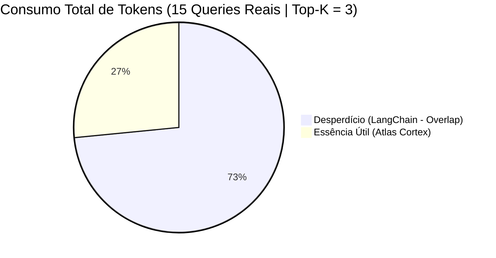

# Atlas Cortex 🧠

**Motor de Parsing Semântico Determinístico para GraphRAG Corporativo**


---

## O que é o Atlas Cortex?

O **Atlas Cortex** é um motor de parsing semântico escrito em **Rust**, que transforma documentos Markdown em **grafos de conhecimento determinísticos**, prontos para consumo por sistemas **GraphRAG** (*Graph-enhanced Retrieval-Augmented Generation*).

Ao invés de fatiar documentos de forma mecânica por contagem de tokens (como o `RecursiveCharacterTextSplitter` do LangChain, que corta frases e tabelas ao meio), o Atlas utiliza a **Abstract Syntax Tree (AST)** do documento via Tree-Sitter para extrair nós semânticos **autocontidos e hierarquicamente conectados**.

---

## Por que o Atlas Cortex existe?

Sistemas RAG tradicionais sofrem de um problema estrutural:

```
Documento bruto
    ↓
Chunking por tamanho fixo (+ 10-20% overlap)
    ↓
Perda de hierarquia, tabelas fragmentadas, contexto perdido
    ↓
Retrieval fragmentado → LLM confuso → Alucinações
```

O Atlas Cortex propõe um caminho diferente:

```
Documento Markdown
    ↓
Parsing via AST (Tree-Sitter + Rust)
    ↓
Nós semânticos tipados (heading, paragraph, table, code_block)
    ↓
Grafo hierárquico com 3 tipos de aresta (child_of, references, semantically_related)
    ↓
Retrieval navegável e preciso → Contexto limpo → Respostas fiéis
```

**Resultado medido:** 63,85% de redução no consumo de tokens para o mesmo nível de recall.

---

## Arquitetura

```
Atlas Cortex V2
│
├── engine/                          # Motor Rust
│   ├── Cargo.toml                   # Dependências: tree-sitter, serde, sha2, regex, anyhow
│   └── src/main.rs                  # Core: AST parsing, node extraction, graph edges, IDs
│
├── python/                          # SDK Python
│   ├── atlas_cortex/
│   │   ├── __init__.py              # API: parse_text(), parse_file(), reconcile_graphs()
│   │   └── integrations/
│   │       └── langchain.py         # AtlasCortexSplitter para LangChain
│   └── tests/
│       ├── test_golden.py           # 10 golden tests de formato determinístico
│       ├── test_hostile.py          # Resiliência: null bytes, Unicode caótico, tabelas quebradas
│       ├── test_reconciliation.py   # Diff topológico de grafos (upsert incremental)
│       ├── test_schema.py           # Validação de schema e tipos de nós/arestas
│       ├── test_security.py         # Path traversal, symlink escape, timeouts, OOM
│       └── test_stress.py           # Carga de 10MB (ativado via `pytest -m stress`)
│
├── scripts/
│   ├── functional_probe.py          # Sonda funcional completa (validação end-to-end)
│   ├── stress_benchmark.py          # Telemetria de escalonamento: 1MB → 100MB
│   ├── benchmark_token_efficiency.py # Comparativo Atlas vs LangChain (tokens)
│   ├── benchmark_retrieval_quality.py # Qualidade de recuperação semântica
│   ├── mock_atlas_ingestor.py       # Simulador de ingestão atômica (MOC)
│   ├── neo4j_graph_pipeline.py      # Pipeline de ingestão para Neo4j
│   └── generate_evidence_pack.ps1   # Gerador de pacote de evidências (auditoria)
│
├── docs/                            # Papers, Quality Gate, Roadmap, GraphRAG Logic
├── examples/                        # Notebook comparativo e documento exemplo
├── functional-probe/                # Outputs de validação funcional
├── web/                             # Dashboard 3D interativo (React/Vite + TypeScript)
├── .github/workflows/ci.yml         # CI/CD: cargo fmt/clippy/test/audit + pytest/ruff/mypy/bandit
├── pyproject.toml                   # Configuração do pacote Python + pytest markers
└── requirements.txt                 # Dependências opcionais para benchmarks
```

---

## Propriedades Validadas

O motor foi submetido a auditoria rigorosa de 11 fases. As cinco propriedades fundamentais foram validadas com evidências executáveis:

| Propriedade | Descrição | Status |
|---|---|---|
| **Fidelidade** | Conteúdo original preservado sem perda | ✅ |
| **Estrutura** | Nós semânticos tipados (heading, paragraph, table, code_block) | ✅ |
| **Conectividade** | Arestas hierárquicas (`child_of`), referenciais (`references`) e semânticas (`semantically_related`) | ✅ |
| **Determinismo** | Mesmo input gera exatamente o mesmo grafo em qualquer execução | ✅ |
| **Utilidade RAG** | Saída consumível por vector DBs, graph DBs e pipelines GraphRAG | ✅ |

---

## Resultados de Benchmarking de Carga

Testes de estresse com documentos sintéticos de alta densidade (âncoras e arestas topológicas):

| Tamanho | Tempo de parsing | Nós gerados | Arestas geradas |
|---|---|---|---|
| 1 MB | 0,91s | 11.740 | 35.217 |
| 5 MB | 5,13s | 58.690 | 176.067 |
| 10 MB | 9,84s | 117.379 | 352.134 |
| 25 MB | 26,29s | 293.446 | 880.335 |
| 50 MB | Rejeitado (OOM protection) | — | — |

O escalonamento é **linear O(N)**. Arquivos acima de 50MB são rejeitados com erro seguro (`File too large → chunk first`) para proteger o servidor contra ataques DoS via OOM.

---

## Benchmark de Eficiência de Tokens

Comparação entre LangChain `RecursiveCharacterTextSplitter` e Atlas Cortex sobre 15 queries reais (Top-K = 3):


```mermaid
pie title Consumo Total de Tokens (15 Queries Reais | Top-K = 3)
    "Desperdício (LangChain - Overlap)" : 9254
    "Essência Útil (Atlas Cortex)" : 3345
```

- **LangChain (1000 char, 20% overlap):** 9.254 tokens totais
- **Atlas Cortex (Nós Topológicos Atômicos):** 3.345 tokens totais
- **Redução:** **63,85%**

Nós atômicos semanticamente autocontidos eliminam a necessidade de overlap, barateando o custo operacional de APIs de LLM em produção.

---

## Instalação e Uso Rápido

### Pré-requisitos

- **Rust** 1.80+
- **Python** 3.9+

### Compilar o Engine

```bash
cd engine
cargo build --release
```

### Instalar o SDK Python

```bash
# Instalar o pacote (pyproject.toml está na raiz do projeto)
pip install -e .

# Dependências opcionais para benchmarks
pip install -r requirements.txt
```

### Uso Básico

```python
from atlas_cortex import parse_text, parse_file

# Parsear texto direto
result = parse_text("# Título\n\nParágrafo de conteúdo.", doc_id="meu_doc")
print(f"Nós: {len(result['nodes'])}")
print(f"Arestas: {len(result['edges'])}")

# Parsear arquivo
result = parse_file("/caminho/para/documento.md", doc_id="doc_001")
```

### Integração com LangChain

```python
from atlas_cortex.integrations.langchain import AtlasCortexSplitter

splitter = AtlasCortexSplitter()
documents = splitter.split_text(markdown_text)

# Cada Document contém metadados de grafo:
# doc.metadata['atlas_node_type']   → "heading" | "paragraph" | "table" | ...
# doc.metadata['atlas_edges_out']   → lista de arestas que partem desse nó
# doc.metadata['atlas_edges_in']    → lista de arestas que chegam nesse nó
```

### Reconciliação de Grafos (Ingestão Incremental)

```python
from atlas_cortex import reconcile_graphs

diff = reconcile_graphs(old_graph, new_graph)
print(diff["added"])    # Nós novos para inserir no Vector DB
print(diff["modified"]) # Nós alterados para atualizar
print(diff["deleted"])  # Nós removidos para excluir
```

---

## Executar Testes

```bash
# Compilar e testar o motor Rust
cd engine && cargo test --release

# Suíte Python completa (30 passam, 3 skipped por dependências opcionais)
pytest python/tests -v

# Apenas testes de estresse de carga pesada (10MB, ~12s)
pytest -m stress -v

# Sonda funcional end-to-end
python scripts/functional_probe.py

# Benchmark de escalonamento completo (1MB → 100MB)
python scripts/stress_benchmark.py
```

---

## Estrutura de Saída (Schema v1.0.0)

```json
{
  "schema_version": "1.0.0",
  "parser_version": "2.0",
  "doc_id": "meu_documento",
  "nodes": [
    {
      "id": "a3f2c1..._1",
      "type": "heading",
      "title": "Introdução",
      "content": "# Introdução",
      "raw_content": "# Introdução",
      "heading_path": [],
      "content_hash": "sha256..."
    },
    {
      "id": "a3f2c1..._2",
      "type": "table",
      "title": "Introdução",
      "content": "| Col | Val |...",
      "table": {
        "header": ["Col", "Val"],
        "rows": [["dado1", "dado2"]]
      }
    }
  ],
  "edges": [
    {
      "id": "sha256...",
      "source": "a3f2c1..._2",
      "target": "a3f2c1..._1",
      "type": "child_of",
      "method": "heading_hierarchy"
    }
  ]
}
```

---

## Segurança

O Atlas Cortex foi projetado com segurança por padrão:

- **Path traversal bloqueado** — caminhos fora do sandbox são rejeitados
- **Timeout de 30s** — subprocesso Rust é morto com erro tratável se exceder o limite
- **OOM Protection** — arquivos > 50MB rejeitados com erro limpo
- **Limites de AST** — profundidade máxima de 100 níveis e 500.000 irmãos
- **Supply chain auditada** — `cargo audit` e `pip-audit` no CI sem vulnerabilidades críticas
- **Sem shell=True** — toda invocação de subprocesso usa lista de argumentos
- **CRLF Normalization** — normalização determinística `\r\n` → `\n` para hashes cross-platform

---

## Dashboard 3D (Frontend)

O repositório inclui um visualizador interativo do grafo semântico construído em React/Vite com efeito Glassmorphism:

```bash
cd web
npm install
npm run dev
# Acesse http://localhost:5173
```

---

## Documentação Técnica

| Documento | Descrição |
|---|---|
| [Paper (PT)](docs/Paper_Atlas_Cortex_PT.md) | Artigo científico completo em Português |
| [Paper (EN)](docs/Paper_Atlas_Cortex_EN.md) | Main whitepaper in English |
| [GraphRAG Logic](docs/GRAPHRAG_LOGIC.md) | Como as arestas são construídas e o grafo navegado |
| [Quality Gate](docs/ATLAS_CORTEX_QUALITY_GATE.md) | Padrão de auditoria, segurança e entrega |
| [Audit Report](docs/ATLAS_CORTEX_AUDIT_REPORT.md) | Relatório oficial de auditoria (11 Fases) |
| [Evolution & Roadmap](docs/EVOLUTION_AND_ROADMAP.md) | Roadmap e decisões evolutivas |
| [QML Ingestion Proof](docs/QML_Ingestion_Proof.md) | Prova empírica e benchmark de stress |

---

## Repositórios

| Repositório | Visibilidade | Conteúdo |
|---|---|---|
| [Atlas-Cortex](https://github.com/icaroths/Atlas-Cortex) | 🌐 Público | Motor completo com todos os testes e telemetria (branch `main`) + versão de avaliação com cota de 750 nós (branch `evaluation`) |
| [Atlas-Cortex_Dev](https://github.com/icaroths/Atlas-Cortex_Dev) | 🔒 Privado | Desenvolvimento sem restrições — Enterprise Ready completo |

---

## Estado do Projeto

```
Atlas Cortex V2                    Versão: 2.0.0-enterprise
─────────────────────────────────────────────────────────────
Core Semântico:       ✅ Production Ready
Motor de Parsing:     ✅ Production Ready  (Rust + Tree-Sitter)
Geração de Grafo:     ✅ Production Ready  (3 tipos de aresta)
Determinismo:         ✅ Production Ready  (IDs SHA-256 estáveis)
Testes Automatizados: ✅ 30 passando, 3 skipped (opcionais)
Testes de Estresse:   ✅ Validado até 25 MB (linear O(N))
Integração LangChain: ✅ AtlasCortexSplitter nativo
Reconciliação:        ✅ reconcile_graphs() implementado
CI/CD:                ✅ GitHub Actions (Rust + Python)
Pipeline Enterprise:  ✅ Production Ready
─────────────────────────────────────────────────────────────
Veredito:             APPROVED / ENTERPRISE READY
```

---

*Construído com Rust, pragmatismo e rigor de engenharia. (c) 2026*
