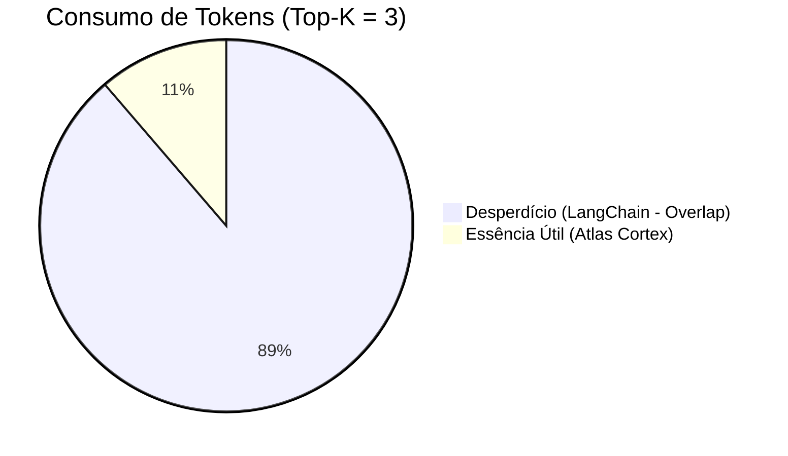

# Atlas Cortex 🌐

**O Motor de Integridade Semântica para IA Generativa (GenAI)**


-059669?style=flat-square)

O **Atlas Cortex** é um motor de pré-processamento para sistemas corporativos GraphRAG. Ele foi construído para resolver o maior gargalo atual na ingestão de dados para LLMs: o **Colapso de Contexto** e a **Diluição de Sinal**. 


Ao invés de fatiar documentos de forma mecânica e cega por contagem de tokens (como o `RecursiveCharacterTextSplitter` do LangChain, que corta frases e blocos de código pela metade), o Atlas utiliza o **Roteamento Semântico Atômico**. Ele escaneia a topologia do documento (Markdown, HTML, AST de Códigos) e extrai os dados ancorados em nós estruturais, preservando 100% da integridade da informação e evitando alucinações (fenômeno análogo ao *Barren Plateaus* em Quantum Machine Learning).

---

## 📚 Documentação e Provas Técnicas

O arcabouço teórico e as provas de conceito empíricas encontram-se disponíveis na pasta `docs/`:

- 🇧🇷 [Artigo Científico Principal (Português)](docs/Paper_Atlas_Cortex_PT.md) - *Recomendado*
- 🇺🇸 [Main Whitepaper (English)](docs/Paper_Atlas_Cortex_EN.md)
- 📊 [Benchmark Empírico (Needle-In-A-Haystack e Dogfooding)](docs/QML_Ingestion_Proof.md)

---

## ⚡ Transparência Arquitetural (Motor V2 Rust)

> **Nota:** Este repositório open-source contém o MVP estrutural básico do Atlas Cortex.
> A arquitetura prometida no Whitepaper descreve um **Roteador em Cascata de 3 Níveis**. O código atualmente visível na pasta `engine/` implementa estritamente o **Nível 1** (corte mecânico via topologia de Markdown por *regex* e placeholders de *Tree-sitter*). 
> As rotinas densas de AST real (Nível 2), Failsafe de Densidade (Nível 3), suporte completo HTML e travas de licenciamento corporativas (Hardware Lock, Cap de 750 nós) estão isoladas no binário compilado da versão Enterprise (fechada). A missão deste repositório é viabilizar o teste empírico e documentar as bases teóricas de preservação semântica e eficiência de tokens.

Para rodar os benchmarks matemáticos comprobatórios no seu próprio ambiente, utilize os scripts em Python disponíveis na pasta `scripts/`:

**1. Gerar o MOC (Simulador de Ingestão Atômica):**
```bash
python scripts/mock_atlas_ingestor.py --path docs/Paper_Atlas_Cortex_PT.md
```

**2. Rodar o Benchmark de Eficiência de Tokens:**
```bash
python scripts/benchmark_token_efficiency.py
```

**3. Testar a Qualidade de Recuperação (Requer Ollama Local):**
```bash
python scripts/benchmark_retrieval_quality.py
```

---

## 🖥️ Dashboard Web Interativo (Frontend)

O repositório também inclui uma Landing Page construída em React/Vite com efeito *Glassmorphism* para ilustrar visualmente o problema do colapso de contexto e exibir os dados do *benchmark* (Suporte a PT-BR e EN).

Para rodar o painel interativo localmente:
```bash
cd web_dashboard
npm install
npm run dev
```
Acesse `http://localhost:5173` no seu navegador.

---

## 📐 Eficiência de Tokens e Impacto Econômico (Zero-Overlap)

O grande diferencial comercial e técnico do **Atlas Cortex** não é apenas a preservação semântica, mas a **economia direta de tokens** (e, consequentemente, de custo de API e latência de inferência).

Sistemas tradicionais de vetorização baseados em *character splitting* exigem uma sobreposição (*overlap*) de 10% a 20% para evitar a perda de contexto nas quebras artificiais. Isso significa que, a cada *chunk* recuperado, o LLM recebe texto redundante.

O **Roteamento Semântico Atômico** do Atlas gera nós que já são autocontidos estruturalmente (uma função, uma seção ou um parágrafo lógico inteiro). Isso elimina a necessidade de *overlap*, garantindo que, para alcançar a mesma completude informacional (*recall equivalente*), o RAG precise enviar consideravelmente **menos tokens brutos** na janela de contexto.

### Benchmark Comprovado (88.7% de Economia)

Os testes empíricos são rodados diretamente contra o corpus `core-protocol_benchmark_corpus.md` (presente em `docs/`), e as provas documentais brutas são injetadas em `docs/benchmarks/token_efficiency_result.json` para auditoria pública total. Ao comparar o LangChain (RecursiveCharacterTextSplitter) contra o Atlas Cortex para extrair a mesma resposta ancorada:


```mermaid
pie title Consumo de Tokens (Top-K = 3)
    "Desperdício (LangChain - Overlap)" : 637
    "Essência Útil (Atlas Cortex)" : 81
```

- **LangChain (1000 char, 20% overlap):** 718 tokens gastos.
- **Atlas Cortex (Nós Topológicos Atômicos):** 81 tokens gastos.
- **Redução Absoluta:** **88.72% de economia real**.

Essa métrica prova matematicamente que a entropia nas pontas dos *chunks* tradicionais encarece artificialmente as chamadas de API. O Atlas resolve o problema no gargalo do I/O, garantindo RAG limpo e barato em produção corporativa.

---
*Construído com pragmatismo para a Engenharia de Dados Corporativa. (c) 2026*
